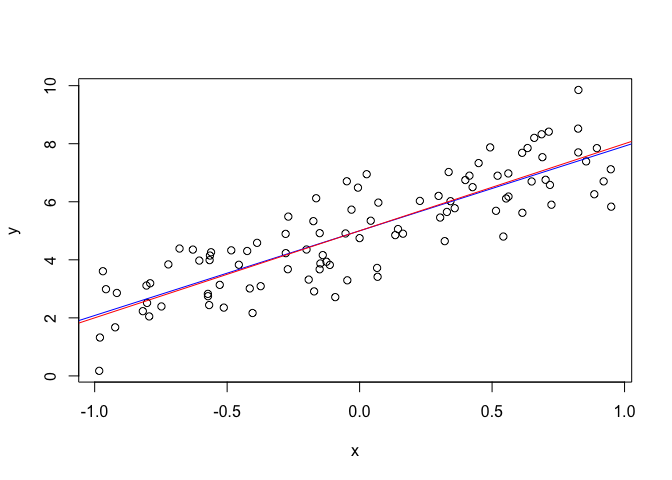

MATH 533 - Assignment 1
================

## Question 6

``` r
sim.linmod <- function(beta.0, beta.1, width, dist, error) {
    
    # x_i's Uniform
    x <- runif(100, -width/2, width/2)
    
    # epsilon_i's Normal or Cauchy
    if(dist == "norm") {
        epsilon <- rnorm(100, 0, 1)
    } else if(dist == "cauchy") {
        epsilon <- rcauchy(100, 0, 1)
    }
    
    # w_i's Normal with error
    delta = rnorm(100, 0, 2)
    w = x + delta
    
    # y_i's
    y <- beta.0 + beta.1 * x + epsilon
    
    # Perform regression and return x, y along with beta.1
    if(error == FALSE) {
        lin <- lm(y ~ x)
        b <- as.numeric(lin$coeff[2])
        return(list("x" = x, "y" = y, "beta.1" = b))
    } else {
        lin <- lm(y ~ w)
        b <- as.numeric(lin$coeff[2])
        return(list("w" = w, "y" = y, "beta.1" = b))
    }
}
```

``` r
# (a)
set.seed(678)

# sample data
sim_a <- sim.linmod(beta.0 = 5, beta.1 = 3, width = 2, dist = "norm", error = FALSE)

# get x_i's and y_i's from simulation
x = sim_a$x
y = sim_a$y

plot(x, y)

# Regression line
abline(lm(y ~ x), col = "blue") 
# True line
abline(a = 5, b = 3, col = "red") 
```

<!-- -->

``` r
# (b)
set.seed(678)

# sample a 1000 times
sim_b <- replicate(1000, sim.linmod(5, 3, 2, "norm", FALSE))

# plot beta.1 values and calculate the mean
betas <- c()
for(i in seq(3, 3000, 3)){betas[i/3] <- sim_b[[i]]}
cat("sample mean: ", mean(betas))
```

    ## sample mean:  3.001036

``` r
hist(betas)
```

<!-- -->

``` r
# (c)
set.seed(678)

# sample a 1000 times
sim_c <- replicate(1000, sim.linmod(5, 3, 2, "cauchy", FALSE))

# plot beta.1 values and calculate the mean
betas <- c()
for(i in seq(3, 3000, 3)){betas[i/3] <- sim_c[[i]]}
cat("sample mean: ", mean(betas))
```

    ## sample mean:  4.979131

As we can see from the histograms below, the distribution of the beta.1
with Cauchy distributed random error is similar to the one with Normal
distributed random error around the true value of beta.1, however there
are more values that are far from the true value. This is because the
Cauchy distribution is tail heavy. Furthermore, the Cauchy distribution
has no defined Mean and Variance and thus even for large sample sizes
the mean does not converge as demonstrated below the histograms. As a
result the mean for beta.1 is unpredictable and can be far off from its
true
value.

``` r
hist(betas, breaks=c(-20000,0,1,2,3,4,5,6,20000), xlim = c(0, 6), main="Histogram of betas around true value")
```

<!-- -->

``` r
hist(betas, ylim = c(0, 10))
```

<!-- -->

``` r
# Cauchy mean does not converge
set.seed(222)
N <- 80000

# sample for Cauchy distribution
y <- rcauchy(N)
x <- 1:N

plot(x, y, pch = ".",  ylim = c(-10, 10))
means <- cumsum(y) / x

# plot means for each sample size
points(x, means, type = "l", col = "red")
par(xpd=TRUE)
legend(0, 15, legend="Mean of samples of size ranging from 1 to 80'000",
       col="red", lty=1:2, cex=0.8)
```

<!-- -->

``` r
# (d) 
set.seed(678)

# sample and plot
sim_d <- sim.linmod(beta.0 = 5, beta.1 = 3, width = 2, dist = "norm", error = TRUE)

# get w_i's and y_i's from simulation
w = sim_d$w
y = sim_d$y

plot(w, y)

# Regression line
abline(lm(y ~ w), col = "blue") 
# True line with no errors in X_i's
abline(a = 5, b = 3, col = "red") 
```

<!-- -->

``` r
# sample a 1000 times
sim_d <- replicate(1000, sim.linmod(5, 3, 2, "norm", error = TRUE))
betas <- c()
for(i in seq(3, 3000, 3)){betas[i/3] <- sim_d[[i]]}
cat("sample mean: ", mean(betas))
```

    ## sample mean:  0.229413

We can see from the histogram that adding an error term to the x\_i’s
reduces the values of beta.1 i.e. decreases the slope. This results from
the fact that adding an error term to the x\_i’s increases the bias of
the model and thus decreases the correlation between x and y. The higher
the Variance in the added error term the closer beta.1 will be to zero.

``` r
hist(betas)
```

<!-- -->
